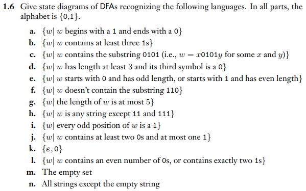

# hw02

### Assigned/Graded Problems:
1. 1.6g
2. 1.6h
3. 1.6i
4. 1.6m

### Problems from the book:

### Instructions
- Complete all work in the python files labeled for each problem. These are the files that will be graded.
- You must use the provided names for the each problem.
- We are using the package `automata-lib` for DFAs in python. Install it using pip: `pip3 install automata-lib`. You do not need to manually install this if you use Docker or Singularity.

### Tips
- The package we're using doesn't allow the list of final states to be empty. If you find the need to circumvent this you can create an extra state that has no transitions to it, and list that in the final states list.
- The basic format is `your_nfa = NFA(...)` (or DFA) and fill in parameters.
- Use `''` for the empty string (lambda), and if a state has two transitions with the same value leading to different states then enter a list of states where you would normally enter the destination. Here is an example to illustrate both of these:
`'q0': {'': {'q1', 'q2'}}`
- If you are interested in the documentation: https://github.com/caleb531/automata/tree/main/docs
- REGEX-Specific details...
- `*`: Kleene star operation, language repeated zero or more times. Ex: `a*`,`(ab)*`
- Concatenation. Ex: `abcd`
- `|`: Union. Ex: `a|b`
- Full syntax documentation seems to have disappeared, but can be found as comments in: https://github.com/caleb531/automata/blob/main/automata/regex/regex.py

# Environments for Doing This Assignment

### Mill-classes
- Head to https://git-classes.mst.edu/mrghx4/millclassesoverview for that overview (you can then use the Singularity option from mill-classes desktop instance)!

### Singularity
1. Get on a campus machine or on PuTTY.
2. Clone the repo. Do not clone it in your SDRIVE. It will throw an error.
3. Run `singularity_run.sh` to enter an environment similar to a Docker container.

### GitLab Browser IDE
1. Go to the repo page on GitLab.
2. Press "." key. This should open a new tab with an IDE. You can edit your code here and push it, but you can not run the autograder. To see the autograder output you will have to go look at the GitLab job output.

### Docker
1. Get Docker set up in your terminal.
2. Run `docker_build.sh` to build the Docker image.
3. Run `docker_run.sh` to enter the container.
4. Use `cd your_code/` to enter the repo directory.

### Linux
- If you are already running linux in some way then you can just install the dependencies for the autograder and run it locally.

# Information regarding this repository

## Auto-grader
### How to run the auto-grader on your machine?
Run the following in the root directory of your repository:
`./grade.sh`

You can also run `python3 unit_tests/unit_test_name.py` to run the unit test for a specific problem.

### How to run the auto-grader on Gitlab-CI?
Make sure all your files are added, committed, and pushed.
Navigate to the Gitlab web interface to confirm these changes exist on the server.

## How to make sure I'm getting points?
* Click on Build -> Jobs -> the latest job.
* Is it passing, green, etc? 
* What grade does it say you have?
* Whatever grade the latest job says, is what we think you have!

## When is this due?
See Canvas!
